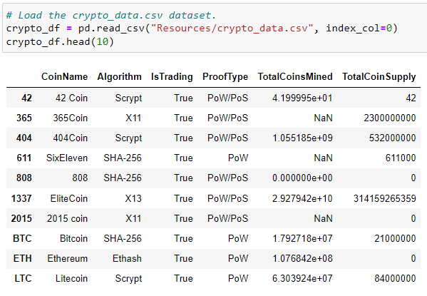
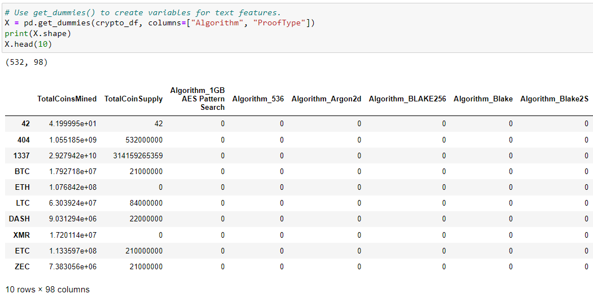
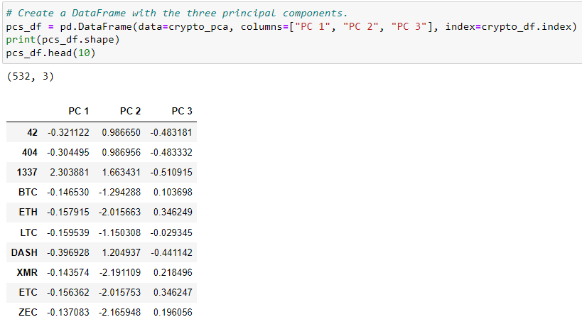
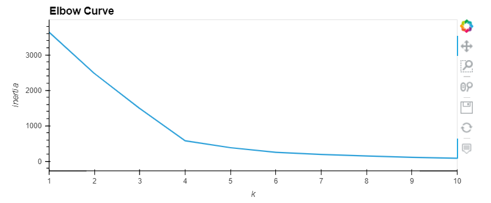
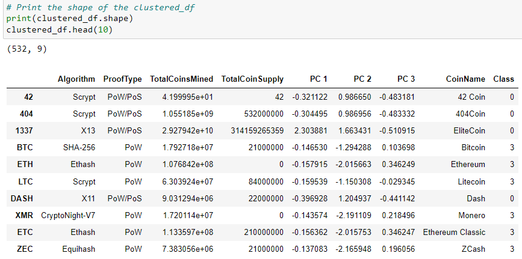
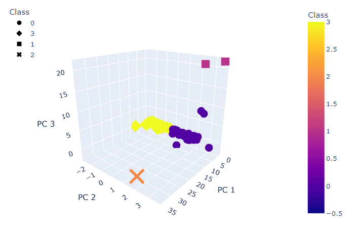
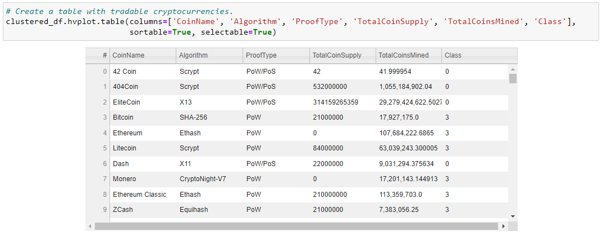
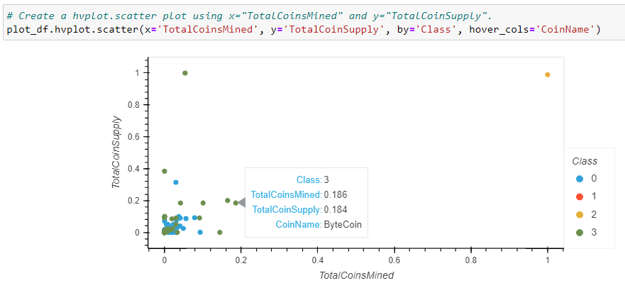

# Cryptocurrencies

## Overview of the analysis

The goal is to analyse a dataset of cryptocurrencies for Accountability Accounting investment bank using the unsupervised machine learning to discover trends and make a desicion to invest in specific cryptocurrencies. The company is interested in offering a new cryptocurrency investment portfolio for its customers, so they’ve asked to create a report that includes what cryptocurrencies are on the trading market and how they could be grouped to create a classification system for this new investment.

## Steps

The analysis consists of below four steps:
- Preprocessing the Data for PCA,
- Reducing Data Dimensions Using PCA,
- Clustering Cryptocurrencies Using K-means,
- Visualizing Cryptocurrencies Results.

## Results

Original data was preprocessed for machine learning to be able to analyse data:

As a result we got 532 cryptocurrencies ready for futher analysis:

Data was standardized with 'StandardScaler()' method. Then PCA was used to reduce dimension to three principal components:

Using the Elbow Curve we found that the best value for K-Means is 4:

As a result we got a new DataFrame with 4 clusters of cryptocurrencies (Class 0, 1, 2, 3):

With visualisations with Plotly Express and 'hvplot' we can see a 3D-Scatter with the PCA data and the clusters:

A new table of tradable cryptocurrencies was created using 'hvplot.table()' function:

Also a final 'hvplot.scatter' plot was built with x="TotalCoinsMined", y="TotalCoinSupply", and by="Class", and it is showing the CoinName when you hover over the the data point:

